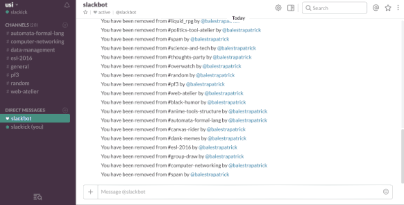

# SlacKick
We have this joke in our university class (yes, university, you read that right) where one user is removed from some channels and then re-added immediately after. This is a quick Swift script to automate the process. Enjoy all the notifications! 😇

<p align="center"></p>

At this moment, the user is removed and immediately re-added from all channels. You could probably make the script more useful by modifying it to add a user to all channels only (useful in case somebody joins your company for example).

## Usage
Open the Xcode project and run it. You can also compile it from the command line if you prefer.

Add your own Authentication token that requires the `users:write` scope. You need to be a Slack admin to generate this key. Insert the username too in the first lines of the script.

```swift
private let token = "YOUR_TOKEN"
private let user = "SLACK_USERNAME"
```

## Disclaimer
1) No people were harmed in the development of this script. 

2) Code written in one hour in a break between final exams studying sessions.

